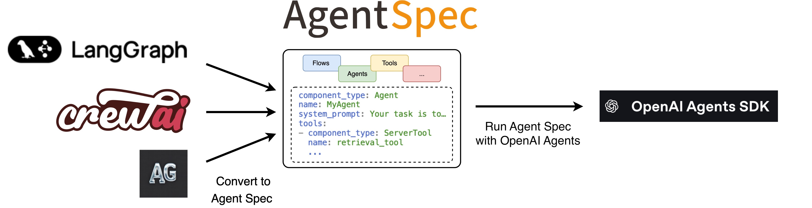

.. _openaiadapter:

===================================
Agent Spec Adapters - OpenAI Agents
===================================

    ↑ With the **Agent Spec adapter for OpenAI Agents SDK**, you can easily import agents
    from external frameworks using Agent Spec and run them with OpenAI Agents.

*The OpenAI Agents SDK enables you to build agentic AI apps in a lightweight,
easy-to-use package with very few abstractions.*

Get started
===========

To get started, set up your Python environment (Python 3.10 or newer required),
and then install the PyAgentSpec package with the OpenAI Agents extension.

.. code-block:: bash

    python -m venv .venv
    source .venv/bin/activate  # On Windows: .venv\Scripts\activate
    pip install "pyagentspec[openai-agents]"

Usage Examples
==============

You are now ready to use the adapter to:

.. toctree::
   :maxdepth: 1

   Run Agent Spec configurations with OpenAI Agents <spec_to_openai>
   Convert OpenAI agents to Agent Spec <openai_to_spec>
